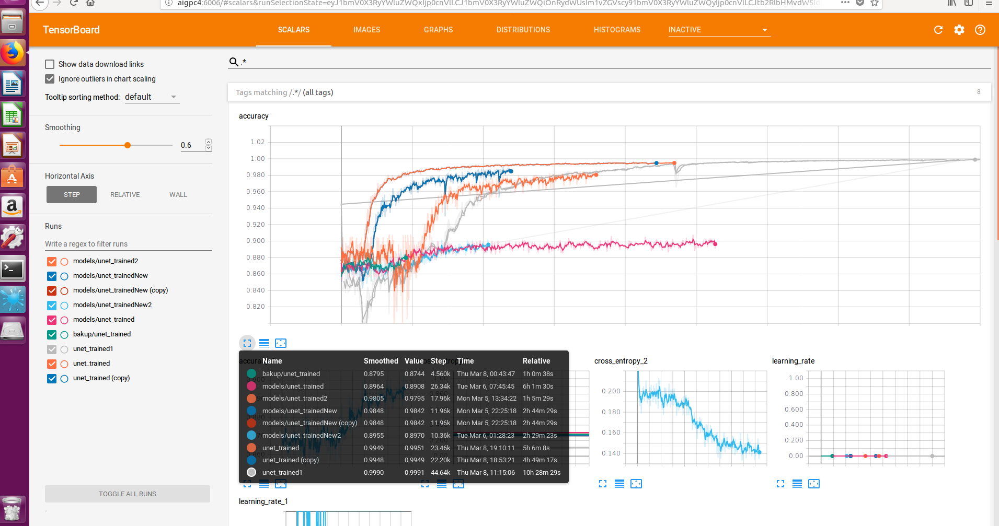
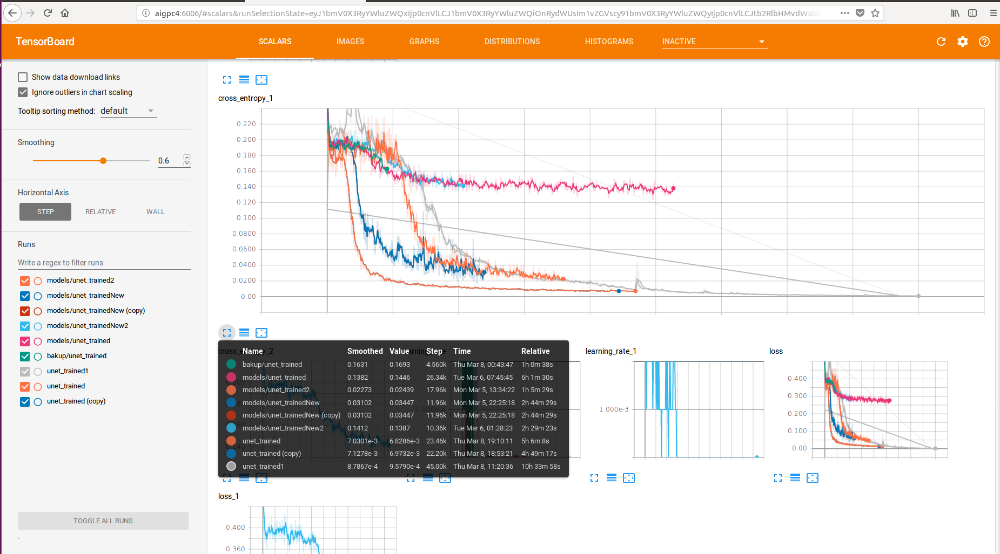

# Neuron Segmentation

This repository contains various algorithms implemented on neurons images segmentation which are completed on CSCI 8360, Data Science Practicum at the University of Georgia, Spring 2018.

This project uses the time series image datasets of neurons from [CodeNeuro](http://neurofinder.codeneuro.org/). Each folder of training and testing images is a single plan, and the images are numbered according to their temporal ordering. The neurons in the images will flicker on and off as calcium is added. In this repository, we are offering three main algorithms as follows using different packages to locate the neurons and segment them out from the surrounding image.

1. Non-negative Matrix Factorization by [thunder-extraction](https://github.com/thunder-project/thunder-extraction)
2. Convolutional Neural Network by [Unet](https://github.com/jakeret/tf_unet)
3. Constrained Non-negative Matrix Factorization by [CaImAn](https://github.com/flatironinstitute/CaImAn)

Read more details about each algorithm and their applications in our [WIKI](https://github.com/dsp-uga/Johnson/wiki) tab.

## Getting Started

These instructions will get you a copy of the project up and running on your local machine for development and testing purposes. See deployment for notes on how to deploy the project on a live system.

### Prerequisites

- [Python 3.6](https://www.python.org/downloads/release/python-360/)
- [Anaconda](https://www.anaconda.com/)

### Environment Setting

1. Clone this repository.
```
$ git clone https://github.com/dsp-uga/Johnson.git
$ cd Johnson
```

2. Create conda environment based on `environments.yml` offered in this repository. 
```
$ conda env create -f environments.yml -n neuron python=3.6
$ source activate neuron
```
Note that `tf_unet` works best in python 2.7, which is also the environment we used for it. (All other experiments are done in Python 3.6). So if you want to use `tf_unet`, create a conda environment as follows:
```
$ conda env create -f environments.yml -n neuron python=2.7
$ source activate neuron
```

3. (**for Unet**)
Clone the source repository by [tf_unet](https://github.com/jakeret/tf_unet), go into tf_unet repository, and set up `tf_unet` in the conda environment, then delete tf_unet repository.
```
$ git clone https://github.com/jakeret/tf_unet
$ cd tf_unet
$ python setup.py install
$ rm -rf tf_unet
```

4. (**for CNMF**)
Clone the sources repository by [CaImAn](https://github.com/flatironinstitute/CaImAn), go into CaImAn repository, and set up `caiman` in the conda environment, then delete CaImAn repository.
```
$ git clone https://github.com/flatironinstitute/CaImAn
$ cd CaImAn
$ python setup.py install
$ rm -rf CaImAn
```
Add `sudo` before the command if you encounter the permission problems.


## Running the tests

```
python -m [option-name] [args-for-the-option]
```

##### Options
  - `ThunderNMF`: Running NMF by `thunder-extraction`
  - `UNET`: Running CNN by `unet`
  - `CNMF`: Running CNMF by `caiman`

Each module provides their own arguments. Use `help()` to know more details when running the algorithms.

## Evaluation

Based on the neurons coordinates, five related scores to determine the results will be generated as follows:

- **Recall**: (number of matched regions)/(number of ground-truth regions)
- **Precision**:  (number of matched regions)/(number of our regions)
- **Inclusion**: (number of intersecting pixels)/(number of total pixels in the ground-truth regions)
- **Exclusion**: (number of intersecting pixels)/(number of total pixels in our regions)
- **Combined**:
<p align="center">

</p>

## Test Results

| Module   | arguments             | Total Score | Avg Precision | Avg Recall | Avg Inclusion | Avg Exclusion |
|----------|-----------------------|-------------|---------------|------------|---------------|---------------|
|ThunderNMF|percentile=99, max_iter=50, overlap=0.1, chunk=32 | 2.94815 | 0.78606 | 0.84156 | 0.56725 | 0.75328 |
|ThunderNMF|percentile=99, max_iter=50, overlap=0.1, chunk=128, padding=15 |  2.852 | 0.663 | 0.93048 | 0.67249 | 0.58641  |
|Unet (only running on 00 sets) | train_iter=120, epoch=500, layer=4, features=64 | 2.93394 | 1.0 | 0.9446 | 0.41857 | 0.57077 |
|CNMF      |k=1000, g=5, merge=0.8 | 2.60321	    | 0.860      | 0.645    | 0.790	     | 0.309      |
|CNMF      |k=700, g=5, merge=0.7  | 2.56363	    | 0.901       |	0.565     | 0.799	     | 0.298     |
|CNMF      |k=1000, g=7, merge=0.85| 2.529	    | 0.868      | 0.599	   | 0.789     | 0.273     |

## Tensorboard Records for Unet training 
#### Accuracy

#### Loss


## TODO
Training tf_unet with padded images, because tf_unet with shrink the image size. Our results from tf_unet is not as good as we expected. We used scaling, but that may not work so well here. See Issues #13 and #18.

## Authors
(Ordered alphabetically)

- **Ankita Joshi** - [AnkitaJo](https://github.com/AnkitaJo)
- **I-Huei Ho** - [melanieihuei](https://github.com/melanieihuei)
- **Jeremy Shi** - [whusym](https://github.com/whusym)

See the [CONTRIBUTORS](CONTRIBUTORS.md) file for details.

## License
This project is licensed under the MIT License - see the [LICENSE.md](LICENSE.md) file for details
